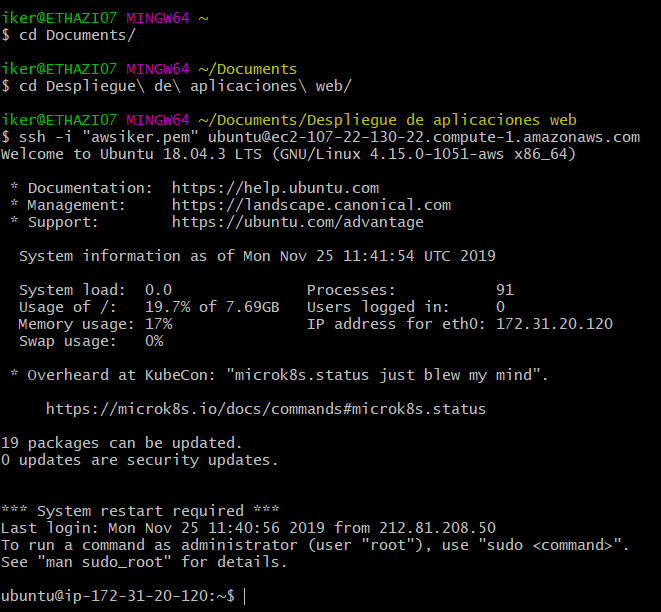

# 1. Conectarse mediante SSH al servidor Ubuntu de AWS.

- [Conectarse vía SSH para comprobar conectividad](#conectarse-via-ssh-para-comprobar-conectividad)

## Conectarse vía SSH para comprobar conectividad

Para conectarnos mediante SSH a nuestro servidor Ubuntu de Amazon Web Services haremos lo siguiente: 

Vamos a la consola y nos colocamos dentro de la carpeta donde tenemos la llave pública.

Y acontinuación, escribimos el siguiente comando en el terminal:

    ssh -i "awsiker.pem" ubuntu@ec2-107-22-130-22.compute-1.amazonaws.com

