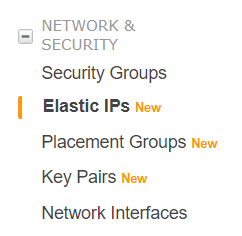
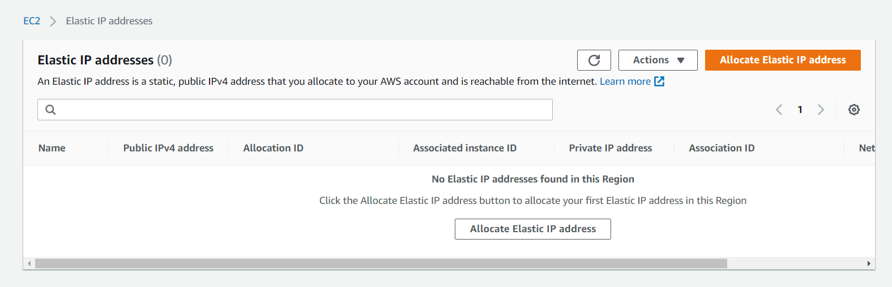
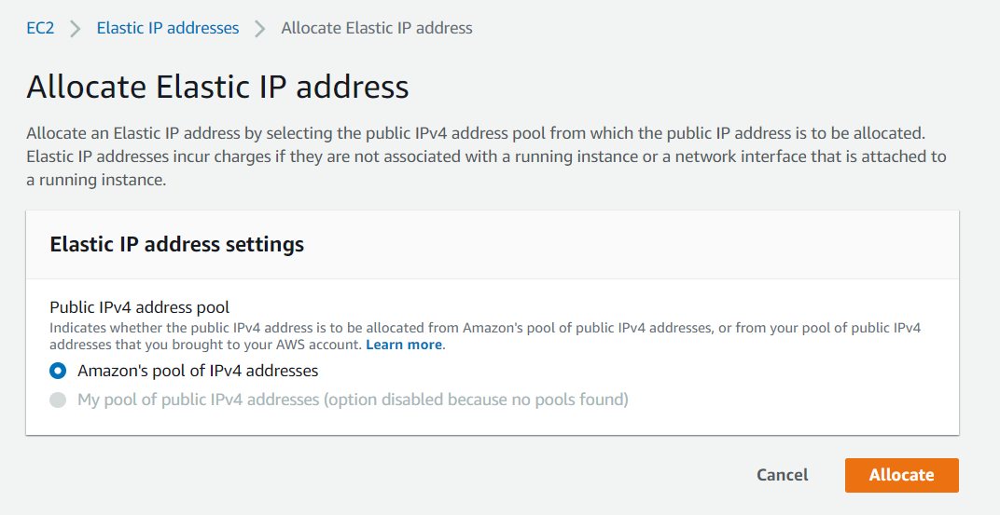
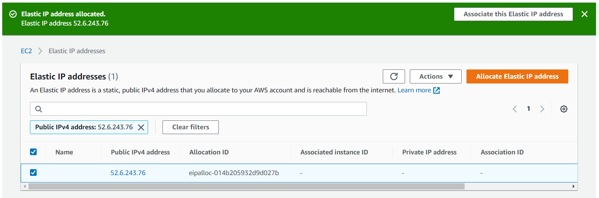
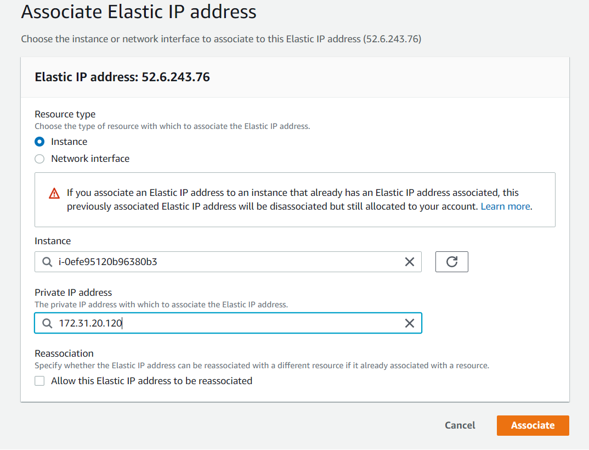

# 2. Solventar problemas de direccionamiento

Vamos a reservar una Elastic IP para tener siempre un mismo dominio/ip para hacer tanto conexiones SSH como HTTP a nuestro servidor.

Para llevarlo a cabo, seguiremos los siguientes pasos:

1. En el panel de navegación, elegimos Elastic IPs (Direcciones IP elásticas).

2. Elegimos Allocate new address (Asignar nueva dirección).

3. En IPv4 address pool (Grupo de direcciones IPv4), elegimos Amazon pool (Grupo de Amazon).

4. Elegimos Allocate (Asignar) y cierre la pantalla de confirmación.

5. Le damos al boton de asociar esta IP Elastica y rellenamos los campos correspondientes con los datos de nuestra máquina.

