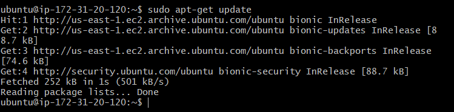

# 3. Instalación.

- [Actualizar lista de paquetes](#actualizar-lista-de-paquetes)

- [Instalar Apache](#instalar-apache)

- [Instalar MySQL](#instalar-mysql)

## Actualizar lista de paquetes

Vamos a ejecutar el siguiente comando para tener actualizada la lista de paquetes en su ultima versión:

    sudo apt-get update

## Instalar Apache

El siguiente paso será la instalación del Apache en nuestra máquina virtual. Para ello, ejecutaremos el siguiente comando:

    sudo apt install apache2

Una vez ejecutado el comando, nos preguntará a ver si queremos continuar, le respondemos que si y se instalará Apache.

 

## Instalar MySQL

A continuación, instalaremos MySQL. MySQL es un sistema de gestión de bases de datos de código abierto. Lo instalaremos de la siguiente forma:

    sudo apt install mysql-server

#### Configurar MySQL

Esto instalará MySQL, pero no nos pedirá que creemos ninguna contraseña ni que hagamos ningún otro cambio de configuración. Dado a que esto deja su instalación de MySQL insegura, vamos a ejecutar el siguiente script de seguridad:

    sudo mysql_secure_installation

Al ejecutar este comando, nos mandará una serie de preguntas sobre la contraseña, usuario, privilegios... Respondemos todas las preguntas y ya tendremos el MySQL configurado.

Escribiendo el siguiente comando entraremos dentro del MySQL

    sudo mysql

