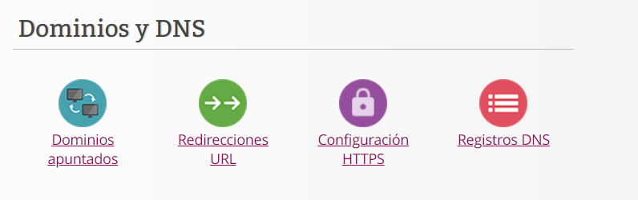
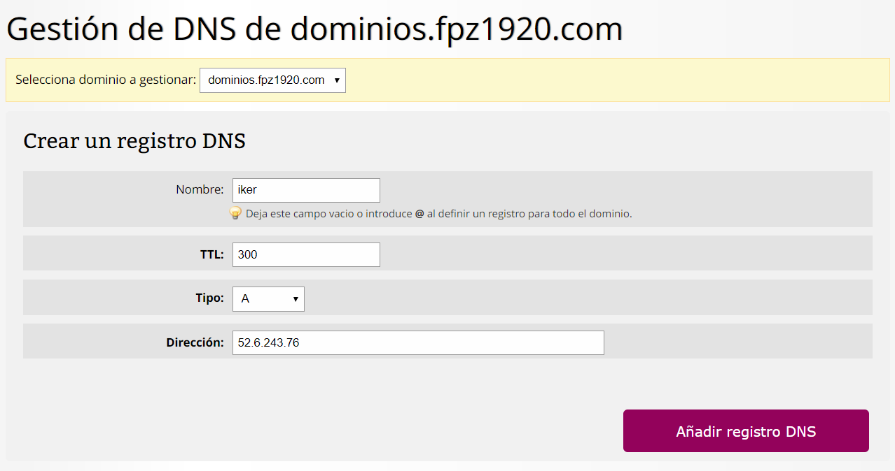
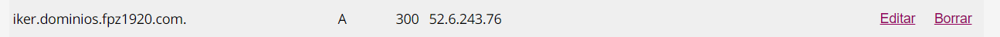

# 3. Gestión de DNS

Nos meteremos en GUEBS, donde tenemos creado un hosting compartido llamado dominios.fpz1920.com. A través del panel de este hosting crearemos el vínculo entre un nuevo subdominio y nuestra instancia en EC2. 

Para ello, entraremos dentro de registros DNS e ingresaremos los datos nombrados a continuación.

El nombre de mi subdominio será iker.dominios.fpz1920.com. El TTL será 300 como bien viene por determinado. El tipo será A, ya que queremos apuntar nuestro dominio hacia un servidor que tenga una dirección IP estática. Y la dirección será la IP Elastica que hemos reservado y asociado en la tarea anterior.

Una vez rellenado los datos, podremos verlos al final de la página donde tenemos todos los subdominios.

#### Tipos de DNS

Los tipos de registros más utilizados son:

- A: Dirección (address). Este registro se usa para traducir nombres de servidores de alojamiento a direcciones IPv4.

- AAAA: Dirección (address). Este registro se usa en IPv6 para traducir nombres de hosts a direcciones IPv6.

- CNAME: Nombre canónico (canonical Name). Se usa para crear nombres de servidores de alojamiento adicionales, o alias, para los servidores de alojamiento de un dominio.

- TXT: Los registros TXT son un tipo de registros de sistema de nombres de dominio (DNS) que contienen información de texto de fuentes externas a tu dominio y que puedes añadir a su configuración.

- SRV: Service record (SRV record).

