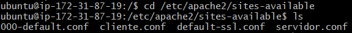
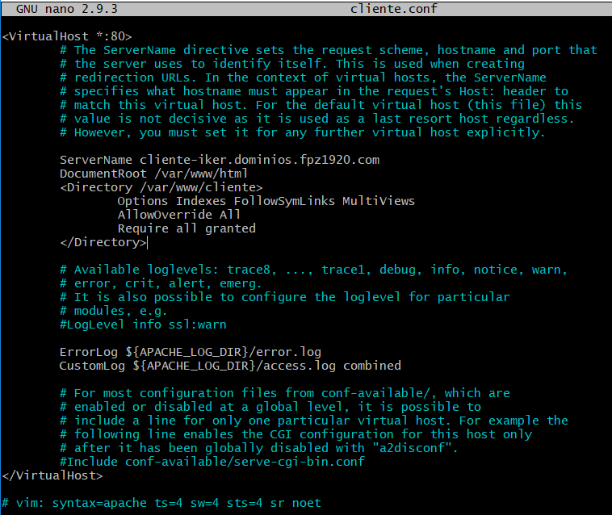
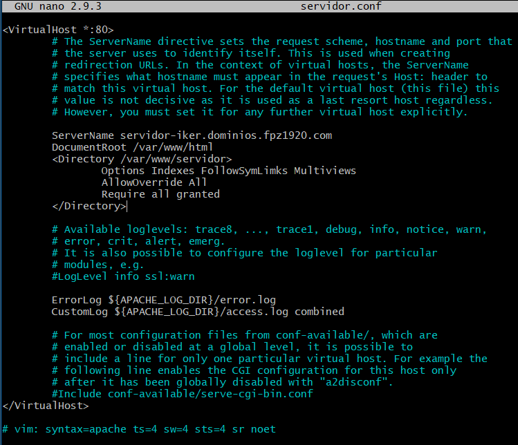
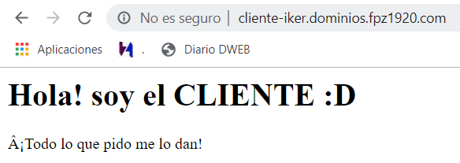
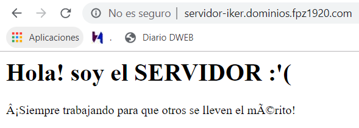

# 4. Virtual Hosts

Lo primero que vamos a hacer es crear los dos virtual hosts:

A continuación editamos los archivos cliente.conf y servidor.conf (con sudo nano). El ServerName tiene el nombre del subdominio creado en GUEBS. En DocumentRoot escribiremos la URL que tenemos que poner en el navegador y dentro de Directory el lugar donde están situados los archivos de nuestra carpeta. En nuestro caso están en /var/www/cliente y /var/www/servidor.

CLIENTE:

SERVIDOR:

Acto seguido, habilitaremos la URL mediante el comando "sudo a2ensite cliente.conf" y "sudo a2ensite servidor.conf"

Para terminar reiniciaremos el servidor con los siguientes comandos:

    sudo systemctl restart apache2

    sudo service apache2 restart

Para comprobar que hemos hecho todo bien, en el navegador escribimos las direcciones del ServerName nos saldrá lo escrito en el index.html de cada carpeta (cliente y servidor).

CLIENTE:

SERVIDOR:

