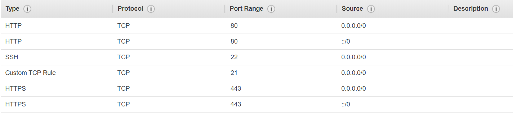
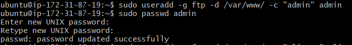
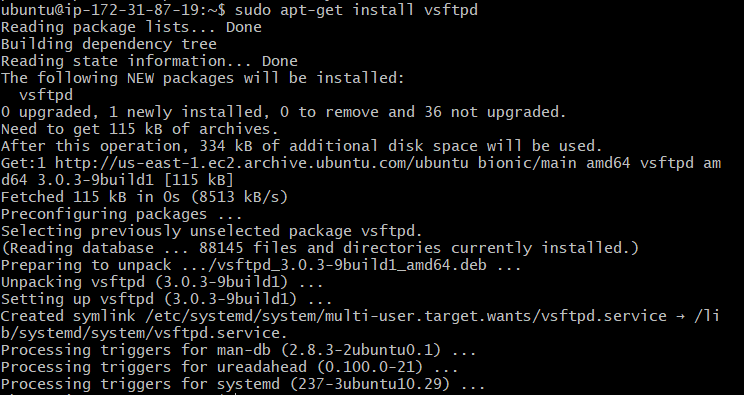

# 5. Servidor FTP

Lo primero que vamos a hacer es habilitar el puerto 21 en el FTP.

A continuación, crearemos los tres siguientes usuarios: cliente, servidor y administrador.

Paso seguido, instalaremos el FTP en nuestra máquina a través del siguiente comando:

    sudo apt-get install vsftpd

