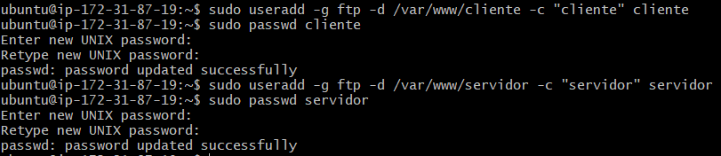

# 5. Servidor FTP

Lo primero que vamos a hacer es habilitar el puerto 21 en el FTP.

Paso seguido, instalaremos el FTP en nuestra máquina a través del siguiente comando:

    sudo apt-get install vsftpd

A continuación, crearemos tres usuarios llamados cliente, servidor y admin en sus respectivos directorios.

Ahora editaremos al archivo FTP.

Y escribimos las siguientes líneas.

Reiniciamos y habilitamos el servicio ftp.

Entramos en WinSCP y nos conectamos con el usuario admin.

Desactivamos el modo pasivo.

Y comprobamos que todos los pasos los hemos hecho bien.

