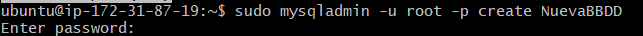

# 6. Crear copias de seguridad mediante comandos

Las carpetas creadas anteriormente, cliente y servidor, las comprimimos y comprobamos que se han hecho adecuadamente.

A continuación, comprobamos el estado de nuestro mysql.

Creamos la base de datos NuevaBBDD con el usuario root.

Creamos una copia de la base de datos creada en el paso anterior y comprobamos si se ha creado correctamente.

