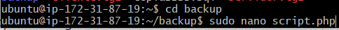

# 7. Automatizar copias de seguridad

- [Crear los script para cliente y servidor](#crear-los-script-para-cliente-y-servidor)

- [Automatizar](#automatizar)

- [Borrado automatizado de backups](#borrado-automatizado-de-backups)

## Crear los script para cliente y servidor

Creamos una carpeta para guardar los backups

Creamos el archivo PHP para ejecutar apuntando al script.sh

Creamos el script.sh

Damos permisos a la carpeta en la que tenemos el PHP

Damos permisos a la carpeta en la que tenemos el script.sh que almacenará las copias de seguridad

Cambiamos usuarios

## Automatizar

## Borrado automatizado de backups

